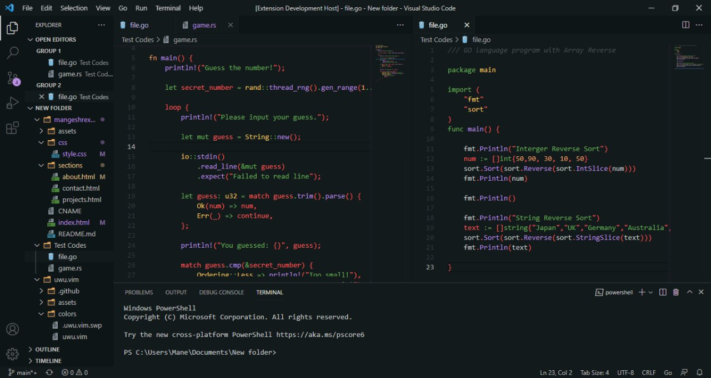

 
	 

 

## UwU Dark Visual Studio Code Theme
This colorscheme is an port of to Visual Studio Code. 

## Installation 
- Just Search "uwu-dark" in the Extensions tab and Install the Plugin. 

## Screenshot 
 

## Contributions 
-  At this moment UwU colorscheme is at its beginning and needs to be ported to most of the programs used in day to day life. So, if anyone of you feels you can port it to your favourite programs then PR's heartily welcomed.

