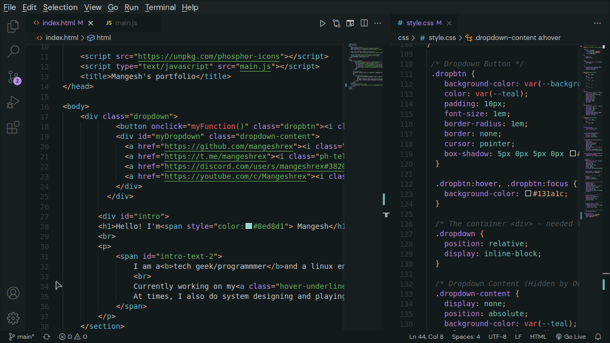

<h2 align="center">Everblush Visual Studio Code</h2>

<p>
<h4 align="center"> <i>Everblush theme for Visual Studio Code</i> </h4>
</p> 

<p align="center"> 

</p>

<p align="center"> 


## Installation
- git clone this repository anywhere on your $HOME.
- Add the cloned directory to ```~/.vscode/extensions```. 
- Or ```download the everblush.tar.gz``` and unzip it to ```~/.vscode/extensions```

The theme would be soon updated on marketplace too. 

# Credits 💝
- [nautilor](https://github.com/nautilor)
