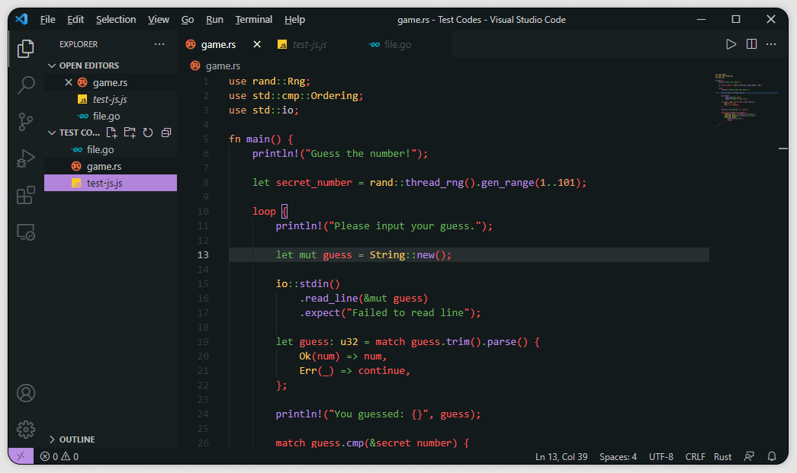

         
        <a href="https://github.com/Mangeshrex/uwu-vscode-theme">UwU Vscode ^-^</a> 

 

<h4 align="center">Specially Designed for better coding experience and productivity.<h4> 

## Preview 

        

## Contributing 
UwU is a Open Source Project and will love to receive contributions from the community. 
Whoever, wants to contribute to this Project can simply fork the repository and create a issue before for letting us know the changes into the colorscheme. 

UwU is not very famous or known to the whole coding community, but yes with the help of user's and community it can for sure. 

